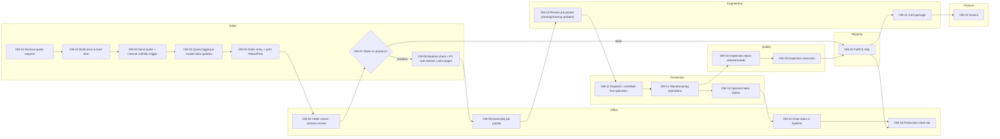

```mermaid
flowchart LR
  subgraph Sales["Sales"]
    OM01["OM-01 Receive quote request"]
    OM02["OM-02 Build price & lead time"]
    OM03["OM-03 Send quote + internal visibility trigger"]
    OM04["OM-04 Quote logging & master data updates"]
    OM05["OM-05 Order entry + print Yellow/Pink"]
    OM07{"OM-07 Stock vs produce?"}
    OM08["OM-08 Material check / PO / job release / print pages"]
  end

  subgraph Office["Office"]
    OM06["OM-06 Order check / contract review"]
    OM09["OM-09 Assemble job packet"]
    OM14["OM-14 Enter labor in Syteline"]
    OM23["OM-23 Production close out"]
  end

  subgraph Engineering["Engineering"]
    OM10["OM-10 Review job packet (routing/drawing updates)"]
    OM21["OM-21 Cert package"]
  end

  subgraph Production["Production"]
    OM11["OM-11 Dispatch / schedule first operation"]
    OM12["OM-12 Manufacturing operations"]
    OM13["OM-13 Operator labor tickets"]
  end

  subgraph Quality["Quality"]
    OM18["OM-18 Inspection report retrieve/create"]
    OM19["OM-19 Inspection execution"]
  end

  subgraph Shipping["Shipping"]
    OM20["OM-20 Fulfill & ship"]
  end

  subgraph Finance["Finance"]
    OM22["OM-22 Invoice"]
  end

  OM01 --> OM02 --> OM03 --> OM04 --> OM05 --> OM06 --> OM07
  OM07 -- "stock" --> OM20
  OM07 -- "produce" --> OM08 --> OM09 --> OM10 --> OM11 --> OM12 --> OM13 --> OM14
  OM12 --> OM18 --> OM19 --> OM20
  OM20 --> OM21 --> OM22
  OM14 --> OM23
  OM20 --> OM23

```

<SwmMeta version="3.0.0" repo-id="Z2l0aHViJTNBJTNBVGl0YW4tT3JkZXItTWFwJTNBJTNBZWxpYndoaXR0bGU=" repo-name="Titan-Order-Map">Powered by [Swimm](https://app.swimm.io/)</SwmMeta>
